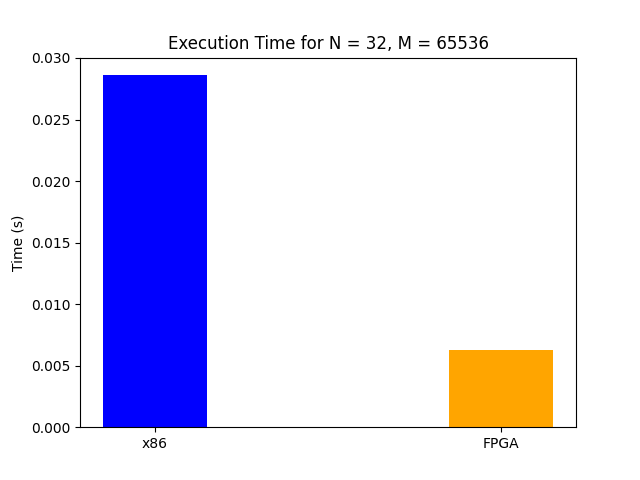
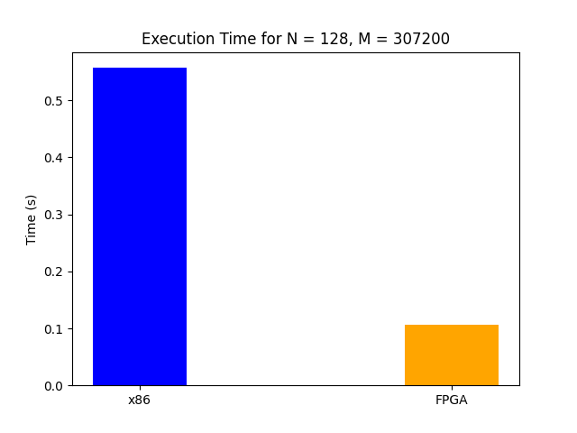

# Optimized FPGA Implementation for Accelerating Local Sequence Alignment

## Software Implementation of LSAL
SW directory contains all the software implementations of the lsal algorithm:
- lsal.c         -> base lsal algorithm
- lsal_opt.c     -> first optimization (optimal algorithm)
- lsal_opt_pad.c -> second optimization (second optimal algorithm, simpler code)

In the same directory there is also a run_all.sh file that you can use to compile, execute and create graphs for different values of (N,M).

In order to get the graphs for the different optimizations execute the bash script:
```console
bash ./run_all.sh
````
The script will create graphs with comparisons of all three implementation for different values of N,M. 
You can modify the python script in order to add or remove N,M values.

## Hardware Implementation of LSAL
Under hw directory there are two hardware implementation of the lsal algorithm:
- lsal_base: the source code of the base algorithm with no optimizations (containing both the kernel and host code for executing on an FPGA)
- lsal_optimized: the source code of the optimized algorithm (kernel+host code)

## Comparison of LSAL on x86 vs FPGA







